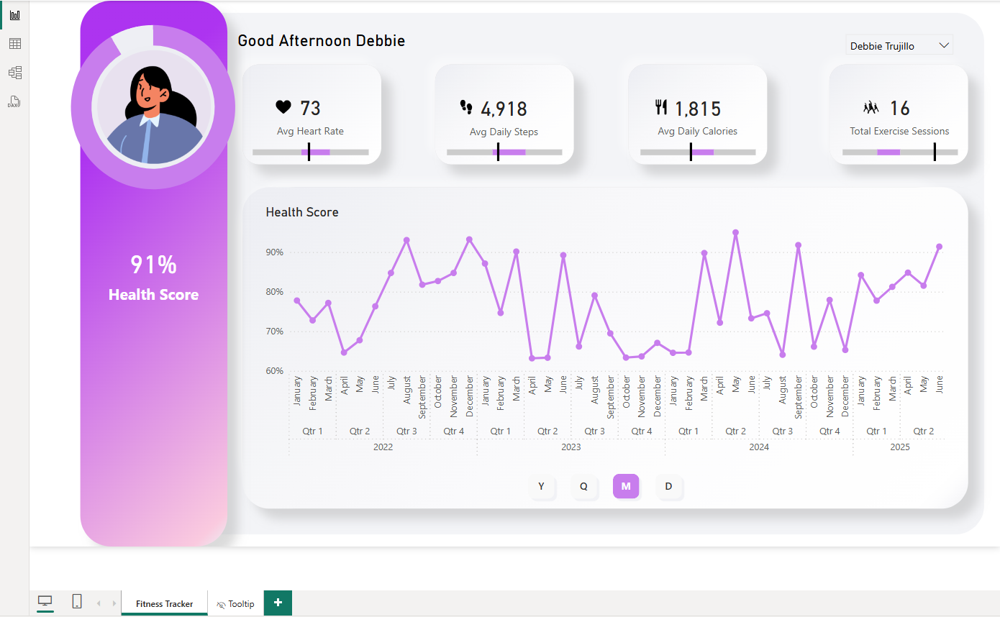

# :bar_chart: Power BI Fitness App Project 

## :pushpin: Overview
This project allows to track user's fitness data and monitor the following: 
- **Overall Health Score**
- **Average Heart Rate**
- **Average Quantity of Steps**
- **Average Quantity of Calories Consumed**
- **Total of Exercise Sessions**
- **Health Score** line chart which helps observe user's activity over the time and get insights about possible trends  
<small>*All the metrics are measured over the last 30 days*</small>

## :framed_picture: Report Preview

## :file_folder: Project Structure
<pre>
Fitness App/
├─ Assets/
│  ├─ Canvas Background/
│  │  ├─ Canvas Background.pptx
│  │  ├─ canvas_background.svg
│  ├─ Icons/
│  │  ├─ calories.png
│  │  ├─ exercise.png
│  │  ├─ heart.png
│  │  ├─ steps.png
├─ Mock Data/
│  ├─ dimUser.csv
│  ├─ fctFitnessStats.csv
├─ Mock Data Scripts/
│  ├─ generate_fitness_data.py
│  ├─ generate_user_data.py
│  ├─ main.py
├─ Screenshots/
│  ├─ full_view.png
│  ├─ preview.png
├─ Fitness App.pbix
├─ README.md
</pre>

## :hammer_and_wrench: Tools Used
- Power BI Desktop
- Python (<small>for generating mock data</small>)
    - `faker`
    - `pandas`
    - `numpy`
    - `random`
    - `pathlib`
- Power Point (<small>for building report design, canvas background</small>)

## :rocket: How To Use?
### The easiest way:
1. Download `Fitness App.pbix` file
2. Open with Power BI Desktop 
### If you an explorer or self-learner and you want to use this project as a guide:
1. Use `main.py` script in `Mock Data Scripts` folder to generate data (you are free to change any line of code you want to)
2. Open Power BI Desktop
3. Create a new report and import data from generated `.csv` files in `Mock Data` folder
4. Start building visuals and measures 
5. Use Power Point to create a background for your report

## :pill: What Can Be Improved?
1. **Measures** - They aren't perfect and I'm believe there are better ways to calculate (for example) the **Health Score** 
2. **User avatars** - Currently user avatars are extracted from external URLs. If the hosting site becomes unavailable or its API changes, the images may fail to display. :wrench: *To improve this*, the avatars could be downloaded, converted to base64, and embedded directly

## :books: References & Free Resources 
- First of all, this project is a follow-along from the [youtube tutorial](https://youtu.be/cYwioeHu_OU?si=PkgDbhqE-xiPQ7-s)
- Secondly, it was a challenge to find user avatars with rounded corners and no background. I am very grateful to the author of [this website](https://avatar-placeholder.iran.liara.run/) as the website shares really beautiful and high-quality background-free rounded user avatars
- The icons are downloaded from [flaticon website](https://www.flaticon.com/)
- To troubleshoot most of the problems that I faced during the project development stage I asked for help of my faithful companions [1](https://chatgpt.com/) and [2](https://www.google.com/)

## :framed_picture: The Last But Not The Least 
At the end, I'd like to share one more picture of the report to help you understand its structure a little bit better

## :raising_hand_man: Author
Volodymyr Karpenko  
[LinkedIn](https://www.linkedin.com/in/volod-karpenko/) • [Email](mailto:volod1701@gmail.com)